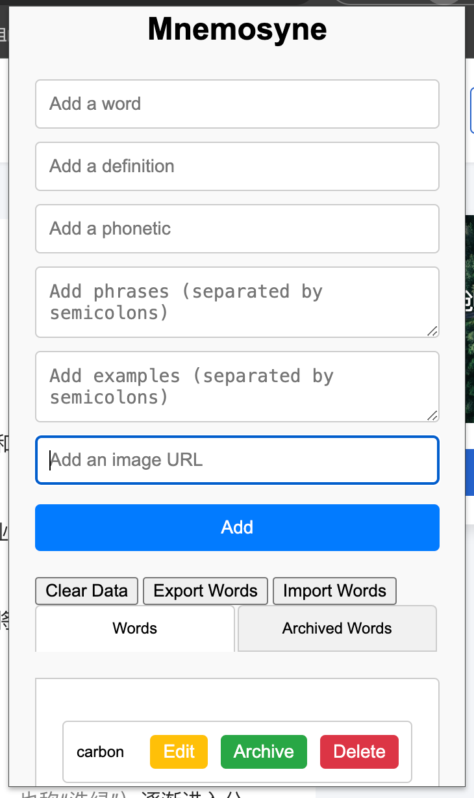

# Mnemosyne - 使用GPT无代码创建的词汇高亮Chrome扩展

## 概述

Mnemosyne是一款独特的Chrome扩展，通过GPT的帮助，您无需编写一行代码即可创建它。这个扩展旨在提升您的语言学习体验，能在网页上高亮显示您词汇表中的单词，帮助您在日常浏览中加深记忆。



## 使用GPT创建Mnemosyne

### 步骤1：定义需求

明确您的需求：创建一个Chrome扩展，能够高亮显示网页中的指定单词，并允许用户管理这些单词（添加、归档等）。

### 步骤2：与GPT交互

通过GPT平台（例如ChatGPT）描述您的需求：

```
我想创建一个Chrome扩展，它可以在网页上高亮显示指定的单词，并允许用户管理这些单词（添加、归档等）。请帮我生成必要的文件和代码。
```

**本项目具体的创建过程如docs文件中的截图**


### 步骤3：获取生成的代码

GPT会根据您的描述生成所需的代码和文件，包括`manifest.json`、`background.js`、`content.js`、`popup.html`、`popup.js`和`styles.css`。

### 步骤4：组装扩展

将GPT生成的代码复制到您的项目目录中，确保目录结构如下：

```
Mnemosyne/
├── manifest.json
├── background.js
├── content.js
├── popup.html
├── popup.js
└── styles.css
```


### 步骤5：加载扩展

1. 打开Chrome并导航到 `chrome://extensions/`。
2. 启用“开发者模式”。
3. 点击“加载已解压的扩展程序”，选择Mnemosyne目录。

### 步骤6：测试和使用

1. 打开扩展弹出窗口，添加您的词汇到词汇表中。
2. 浏览网页，查看单词是否被高亮显示。
3. 使用归档功能管理已记住的单词。

## 功能

- **词汇高亮**：在任何网页上高亮显示词汇表中的单词，以橙色标记。
- **归档单词**：归档已记住的单词，以防止它们被高亮显示。
- **在线数据库集成**：同步您的词汇表到自建的在线数据库，实现无缝数据管理。

## 文件和目录

- `manifest.json`：描述扩展属性和权限的清单文件。
- `background.js`：管理扩展生命周期的后台脚本。
- `content.js`：与网页交互以高亮词汇的内容脚本。
- `popup.html`：扩展弹出窗口的HTML文件。
- `popup.js`：扩展弹出窗口的JavaScript功能文件。
- `styles.css`：用于扩展弹出窗口样式的CSS文件。

## 项目阶段

### 阶段 1

- 实现基本的高亮词汇表单词功能。
- 归档功能以管理已记住的单词。

### 阶段 2（计划中）

- 与anki打通，让移动端和Chrome插件数据进行同步

## 贡献

我们欢迎贡献！如果您有任何建议、错误报告或功能请求，请创建问题或提交拉取请求。

## 许可证

此项目使用MIT许可证 - 详情请参见 [LICENSE](LICENSE) 文件。

## 联系方式

如有任何问题或反馈，请联系在Twitter上关注我们 [@warpoet](https://twitter.com/le284)。
